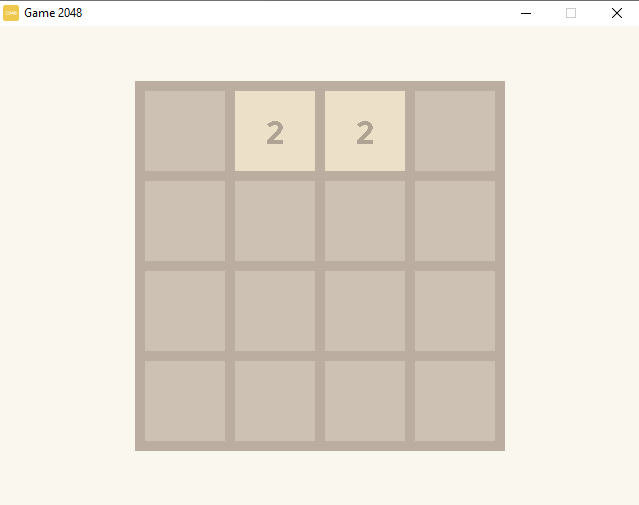

# Game2048
<h1>Description</h1>

  Recreation of 2048 game made in one day from scratch using c++

<h1>Command to compile</h1>

g++ -c src/*.cpp -std=c++14 -O3 -IC:/mingw64/include -Wall -m64 && g++ *.o -o bin/Release/main -LC:/mingw64/lib -mwindows -lmingw32 -lSDL2main -lSDL2_image -lSDL2 -lSDL2_ttf -s && start bin/Release/main

<h1>Image of the game</h1>

